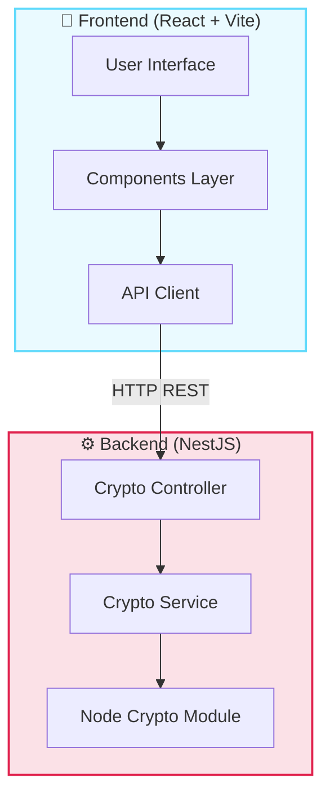
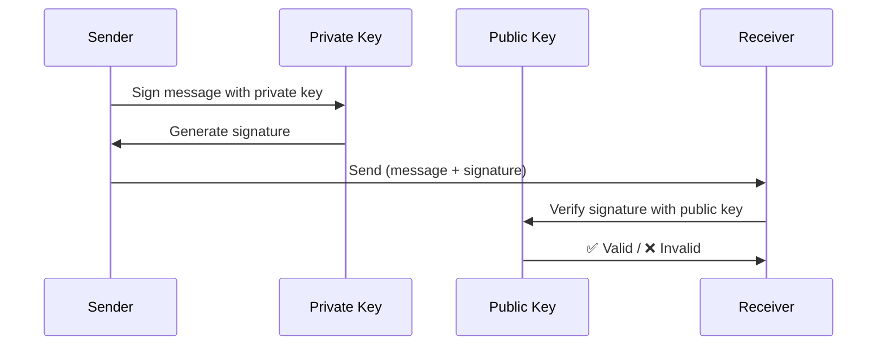

<div align="center">

# 🔐 Secure Message Application (SMA)

### A Full-Stack Cryptographic Messaging Platform


*A secure end-to-end encrypted messaging application demonstrating modern cryptographic techniques*

</div>

---

## 📋 Table of Contents

- [Overview](#-overview)
- [Tech Stack](#-tech-stack)
- [Architecture](#-architecture)
- [Cryptographic Features](#-cryptographic-features)
- [Installation & Setup](#-installation--setup)
- [API Documentation](#-api-documentation)

---

## 🎯 Overview

The **Secure Message Application (SMA)** is a full-stack cryptographic messaging platform that demonstrates professional-grade security implementations. This application showcases encryption, decryption, digital signatures, signature verification, and cryptographic hashing using industry-standard algorithms.

### ✨ Key Features

- 🔒 **AES-256-GCM Encryption** - Symmetric encryption with authenticated encryption mode
- ✍️ **RSA-2048 Digital Signatures** - Asymmetric cryptography for message authentication
- #️⃣ **SHA-256 Hashing** - Cryptographic hash functions for data integrity
- 💬 **Real-time Messaging** - Secure message storage and retrieval
- 🎨 **Modern UI/UX** - Beautiful, responsive interface with explain mode for crypto details

---

## 🛠️ Tech Stack

### Backend Stack

| Technology | Version | Purpose |
|------------|---------|---------|
| **NestJS** | `v11.0.1` | Progressive Node.js framework for building efficient server-side applications |
| **TypeScript** | `v5.7.3` | Strongly-typed programming language for better code quality |
| **Node.js Crypto** | Built-in | Native cryptographic functionality for encryption/signing |
| **Class Validator** | `v0.14.3` | Decorator-based validation for DTOs |
| **Class Transformer** | `v0.5.1` | Object transformation and serialization |

### Frontend Stack

| Technology | Version | Purpose |
|------------|---------|---------|
| **React** | `v19.2.0` | Modern UI library for building interactive interfaces |
| **TypeScript** | `v5.9.3` | Type-safe development |
| **Vite** | `v7.2.4` | Lightning-fast build tool and dev server |
| **TailwindCSS** | `v4.1.18` | Utility-first CSS framework for rapid UI development |

### Development Tools

- **ESLint** - Code linting and quality enforcement
- **Prettier** - Code formatting
- **Jest** - Testing framework
- **TypeScript ESLint** - TypeScript-specific linting rules

---

## 🏗️ Architecture



---

## 🔐 Cryptographic Features

### 1️⃣ SHA-256 Hashing

**Purpose:** Generate a fixed-size cryptographic hash of any message for data integrity verification.

#### 📸 Implementation Snapshot

```typescript
// File: backend/src/crypto/crypto.service.ts

hash(message: string): string {
  return createHash('sha256').update(message).digest('hex');
}
```

#### 🔍 How it Works

1. **Input:** Any string message
2. **Algorithm:** SHA-256 (Secure Hash Algorithm 256-bit)
3. **Output:** 64-character hexadecimal string
4. **Properties:** 
   - ✅ Deterministic (same input = same output)
   - ✅ One-way function (cannot reverse)
   - ✅ Collision-resistant

#### 💡 Example Usage

```typescript
// Input
const message = "Hello, World!";

// Output
const hash = "dffd6021bb2bd5b0af676290809ec3a53191dd81c7f70a4b28688a362182986f";
```

**Use Case:** Verifying data integrity, password storage, digital fingerprints

---

### 2️⃣ AES-256-GCM Encryption

**Purpose:** Symmetric encryption providing both confidentiality and authenticity.

#### 📸 Implementation Snapshot

```typescript
// File: backend/src/crypto/crypto.service.ts

encrypt(message: string): EncryptedPayload {
  // Generate random initialization vector (12 bytes for GCM)
  const initializationVector = randomBytes(12);
  
  // Create cipher using AES-256-GCM algorithm
  const cipher = createCipheriv('aes-256-gcm', this.aesKey, initializationVector);
  
  // Encrypt the message
  const ciphertext = Buffer.concat([
    cipher.update(message, 'utf8'), 
    cipher.final()
  ]);
  
  // Get authentication tag for integrity verification
  const authTag = cipher.getAuthTag();

  return {
    ciphertext: ciphertext.toString('base64'),
    iv: initializationVector.toString('base64'),
    authTag: authTag.toString('base64'),
  };
}
```

#### 🔍 How it Works

1. **Key Generation:**
   ```typescript
   private buildAesKey(): Buffer {
     const secretSource = process.env.AES_SECRET_KEY ?? 'tp-crypto-demo-key';
     return createHash('sha256').update(secretSource).digest();
   }
   ```
   - Uses SHA-256 to derive a 256-bit key from a secret

2. **Encryption Process:**
   - Generate random 12-byte IV (Initialization Vector)
   - Encrypt message using AES-256 in GCM mode
   - Extract authentication tag for tamper detection

3. **Output Components:**
   - `ciphertext`: Encrypted message
   - `iv`: Initialization vector (needed for decryption)
   - `authTag`: Authentication tag (ensures data hasn't been tampered)

#### 📸 Decryption Snapshot

```typescript
decrypt(payload: EncryptedPayload): string {
  // Create decipher with the same algorithm and key
  const decipher = createDecipheriv(
    'aes-256-gcm',
    this.aesKey,
    Buffer.from(payload.iv, 'base64'),
  );
  
  // Set authentication tag for verification
  decipher.setAuthTag(Buffer.from(payload.authTag, 'base64'));
  
  // Decrypt the ciphertext
  const plaintext = Buffer.concat([
    decipher.update(Buffer.from(payload.ciphertext, 'base64')),
    decipher.final(),
  ]);
  
  return plaintext.toString('utf8');
}
```

**Security Properties:**
- ✅ **Confidentiality:** AES-256 encryption
- ✅ **Authenticity:** GCM mode provides authentication
- ✅ **Integrity:** Authentication tag detects tampering

---

### 3️⃣ RSA-2048 Digital Signatures

**Purpose:** Asymmetric cryptography for message authentication and non-repudiation.

#### 📸 Key Pair Generation

```typescript
// File: backend/src/crypto/crypto.service.ts

constructor() {
  // Generate RSA key pair on service initialization
  const keyPair = generateKeyPairSync('rsa', {
    modulusLength: 2048,                              // 2048-bit key size
    publicKeyEncoding: { type: 'spki', format: 'pem' },  // Public key format
    privateKeyEncoding: { type: 'pkcs8', format: 'pem' }, // Private key format
  });
  
  this.privateKey = keyPair.privateKey;  // Keep private key secure
  this.publicKey = keyPair.publicKey;    // Share public key
}
```

#### 📸 Signing Implementation

```typescript
sign(message: string): string {
  // Create signer using RSA-SHA256 algorithm
  const signer = createSign('RSA-SHA256');
  
  // Update signer with the message to sign
  signer.update(message);
  signer.end();
  
  // Sign using private key
  const signature = signer.sign(this.privateKey);
  
  return signature.toString('base64');
}
```

#### 📸 Verification Implementation

```typescript
verify(message: string, signature: string): boolean {
  // Create verifier using the same algorithm
  const verifier = createVerify('RSA-SHA256');
  
  // Update verifier with the original message
  verifier.update(message);
  verifier.end();
  
  // Verify signature using public key
  return verifier.verify(
    this.publicKey, 
    Buffer.from(signature, 'base64')
  );
}
```

#### 🔍 How Digital Signatures Work



**Security Properties:**
- ✅ **Authentication:** Proves who sent the message
- ✅ **Non-repudiation:** Sender cannot deny sending it
- ✅ **Integrity:** Detects if message was modified

---

## 🚀 Installation & Setup

### Prerequisites

- Node.js (v18 or higher)
- npm or yarn

### Backend Setup

```bash
# Navigate to backend directory
cd backend

# Install dependencies
npm install

# Start development server
npm run start:dev
```

✅ Backend runs on **http://localhost:3000**

### Frontend Setup

```bash
# Navigate to frontend directory
cd frontend

# Install dependencies
npm install

# Start development server
npm run dev
```

✅ Frontend runs on **http://localhost:5173**

---

## 📡 API Documentation

### Base URL
```
http://localhost:3000
```

### Endpoints

#### 🔒 Encrypt Message
```http
POST /crypto/encrypt
Content-Type: application/json

{
  "message": "Hello, World!"
}
```

**Response:**
```json
{
  "ciphertext": "8J3K9L2M...",
  "iv": "a1b2c3d4...",
  "authTag": "x9y8z7..."
}
```

---

#### 🔓 Decrypt Message
```http
POST /crypto/decrypt
Content-Type: application/json

{
  "ciphertext": "8J3K9L2M...",
  "iv": "a1b2c3d4...",
  "authTag": "x9y8z7..."
}
```

**Response:**
```json
{
  "plaintext": "Hello, World!"
}
```

---

#### ✍️ Sign Message
```http
POST /crypto/sign
Content-Type: application/json

{
  "message": "Hello, World!"
}
```

**Response:**
```json
{
  "signature": "mK9L3nP2..."
}
```

---

#### ✅ Verify Signature
```http
POST /crypto/verify
Content-Type: application/json

{
  "message": "Hello, World!",
  "signature": "mK9L3nP2..."
}
```

**Response:**
```json
{
  "isValid": true
}
```

---

#### #️⃣ Hash Message
```http
POST /crypto/hash
Content-Type: application/json

{
  "message": "Hello, World!"
}
```

**Response:**
```json
{
  "hash": "dffd6021bb2bd5b0af676290809ec3a53191dd81c7f70a4b28688a362182986f"
}
```

---

#### 🔑 Get Public Key
```http
GET /crypto/public-key
```

**Response:**
```json
{
  "publicKey": "-----BEGIN PUBLIC KEY-----\nMIIBIjANBgkqhki..."
}
```

---

## 📚 Project Structure

```
tp-crypto/
├── backend/                    # NestJS backend application
│   ├── src/
│   │   ├── crypto/            # Cryptography module
│   │   │   ├── crypto.controller.ts    # REST API endpoints
│   │   │   ├── crypto.service.ts       # Core crypto logic
│   │   │   ├── crypto.module.ts        # Module definition
│   │   │   └── dto/                    # Data Transfer Objects
│   │   ├── messages/          # Message storage module
│   │   ├── app.module.ts      # Root application module
│   │   └── main.ts            # Application entry point
│   ├── package.json
│   └── tsconfig.json
│
├── frontend/                   # React frontend application
│   ├── src/
│   │   ├── components/        # React components
│   │   ├── api/              # API client
│   │   ├── App.tsx           # Main application component
│   │   └── main.tsx          # Application entry point
│   ├── package.json
│   └── vite.config.ts
│
└── README.md                  # This file
```

---

## 🎓 Educational Value

This project demonstrates:

1. **Modern Web Development Practices**
   - RESTful API design
   - Component-based UI architecture
   - Type-safe development with TypeScript

2. **Cryptographic Implementations**
   - Symmetric encryption (AES-256-GCM)
   - Asymmetric encryption (RSA-2048)
   - Hash functions (SHA-256)
   - Digital signatures

3. **Security Best Practices**
   - Authenticated encryption
   - Proper key management
   - Secure random number generation
   - Input validation with DTOs

4. **Professional Development Tools**
   - Code linting and formatting
   - Type checking
   - Modern build tools

---

<div align="center">

### 🌟 Built with Passion and Security in Mind

**Created by:** Meshari  
**Course:** Cryptography & Security  
**Year:** 2026

</div>

---

## 📄 License

This project is for educational purposes.

# tp-cryptographie
